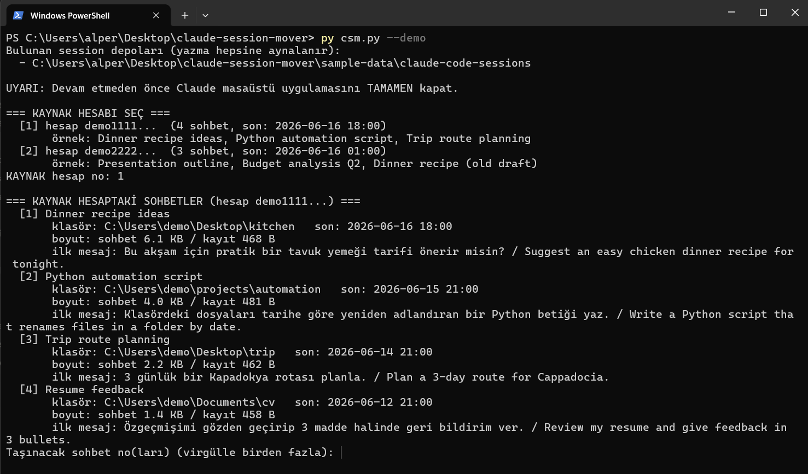
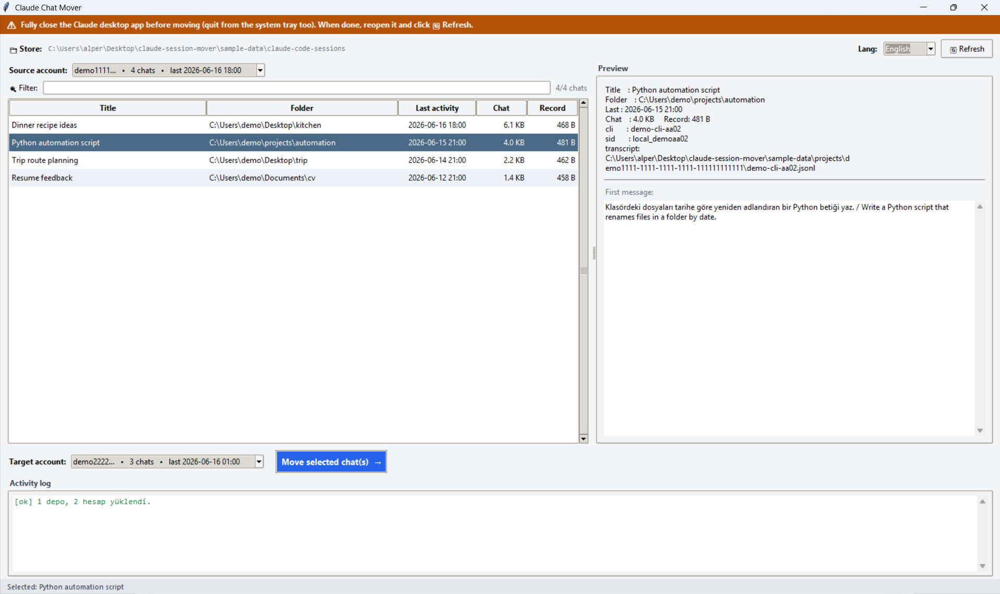
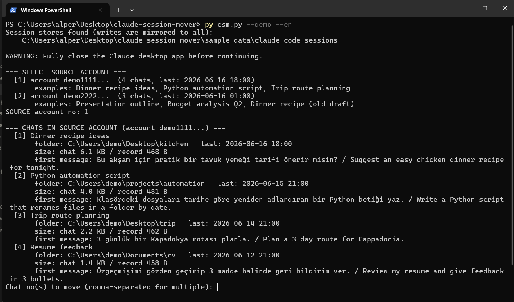

# Claude Session Mover · Claude Sohbet Taşıyıcı


**Dil / Language:  [🇹🇷 Türkçe](#tr) · [🇬🇧 English](#en)**

Claude masaüstü uygulamasındaki oturumları bir hesaptan diğerine taşıyan küçük bir
araç. İki oturum tipi desteklenir: **Claude Code** (masaüstü sohbetleri) ve
**Cowork** (agent oturumları). Hesaplar **e-posta** ile gösterilir. /
A small tool that moves Claude desktop sessions from one account to another.
Two session types are supported: **Claude Code** (desktop chats) and **Cowork**
(agent sessions). Accounts are shown by **e-mail**.

| Dosya / File | Tür / Type | Açıklama / Description |
|--------------|------------|------------------------|
| [`csm.py`](csm.py)   | Terminal (CLI)   | Soru-cevap akışı / Interactive prompts |
| [`csmui.py`](csmui.py) | Tkinter (GUI)  | Liste, önizleme, boyut karşılaştırması / List, preview, size compare |
| [`i18n.py`](i18n.py)  | Ortak / Shared | TR/EN çeviriler / TR/EN translations |

> ⚠️ **Resmî değildir / Unofficial.** Kendi sorumluluğunuzda kullanın. Use at your own risk.

---

<a id="tr"></a>
## 🇹🇷 Türkçe

### Sorun: "Sohbetim diğer hesapta kaldı, bu hesapta görünmüyor"

Claude masaüstü uygulaması, sohbet **listeleme kayıtlarını hesap bazında** ayrı
klasörlerde tutar:

```
<base>\<hesap-id>\<workspace-id>\local_<uuid>.json
```

Uygulama yalnızca **o an giriş yapılı hesabın** klasörünü okur. Başka bir hesapta
açılmış sohbet bu yüzden listede görünmez — ama **silinmemiştir**.

- **Sohbet metni (transkript)** `~/.claude/projects\...\<cliSessionId>.jsonl` altında,
  **ortaktır ve hesaba bağlı değildir.**
- Hesaba bağlı olan tek şey **listeleme kaydı** (`local_*.json`).

Bu araç sadece o küçük listeleme kaydını hedef hesaba kopyalar.

Kayıt dosyasının iki kilit alanı:
- `sessionId` → `local_<uuid>` (dosya adıyla **aynıdır**)
- `cliSessionId` → asıl transkript `.jsonl` dosyasını işaret eder

### İki oturum tipi

| Tip | Depo klasörü | Taşınan |
|-----|--------------|---------|
| **Claude Code** | `claude-code-sessions` | `local_*.json` kaydı |
| **Cowork** | `local-agent-mode-sessions` | `local_*.json` kaydı **+ yanındaki `local_<uuid>/` klasörü** (audit, outputs, uploads, .claude) |

- **CLI:** çalıştırınca önce **hangi tipi taşıyacağını sorar** (1 = Claude Code, 2 = Cowork).
- **GUI:** üstte **iki sekme** vardır — her tip kendi sekmesinde.
- **E-posta gösterimi:** hesap UUID'leri, Cowork oturumlarındaki
  `.claude/.claude.json → oauthAccount` alanından **e-postaya** çözülür. Çözülemeyen
  hesaplar kısa UUID ile gösterilir. Hesaplar **son aktiviteye göre** sıralanır ve
  kaynak listesinde **hiç oturumu olmayan hesaplar gizlenir**.

### Gereksinim
- **Python 3.8+** (gerçek kurulum; Microsoft Store/sandbox Python **önerilmez**).
- GUI için **tkinter** (python.org kurulumlarında hazır gelir).
- Ek bağımlılık yok (yalnızca standart kütüphane).

### Platform desteği
- **Windows:** tam test edildi / birincil hedef.
- **macOS / Linux:** *deneysel*. Veri klasörü otomatik denenir
  (`~/Library/Application Support/Claude/…` ve `~/.config/Claude/…`). Bulunamazsa
  yolu kendin ver: `CSM_BASE=/yol/claude-code-sessions` (ve gerekiyorsa
  `CSM_PROJECTS=/yol/.claude/projects`).
- macOS/Linux'ta `py` yerine `python3` kullan: `python3 csmui.py`.
- `--demo` her platformda çalışır (gerçek veriye dokunmadan denemek için).
- Hata bulursan lütfen [Issues](https://github.com/alpersamur3/claude-session-mover/issues)
  üzerinden bildir (OS + `csm.py` tanı çıktısıyla).

### Kullanım
Windows'ta **`py` launcher** en güvenlisidir (gerçek Python'a gider):

```powershell
py csmui.py            # Grafik arayüz (Türkçe)
py csmui.py --en       # Grafik arayüz (İngilizce)
py csm.py              # Terminal
py csm.py --en         # Terminal (İngilizce)
```

GUI'de sağ üstten **TR/EN** dilini anında değiştirebilirsiniz.

**Adımlar:**
1. **Claude masaüstü uygulamasını tamamen kapatın** (sistem tepsisinden de çıkın).
2. Aracı çalıştırın.
3. **Oturum tipini** seçin — CLI başta sorar; GUI'de **Claude Code / Cowork** sekmesi.
4. **Kaynak hesabı** seçin (e-posta ile listelenir) → oturumlar listelenir.
5. Taşımak istediğiniz oturum(lar)ı seçin.
6. **Hedef hesabı** seçin (kaynak listede çıkmaz; GUI'de **hedef otomatik seçilmez**,
   bilinçli seçmeniz gerekir).
7. Taşıyın. Çakışma varsa boyutları görüp **üzerine yaz / atla** kararını verin.
8. Claude'u yeniden açın; oturum hedef hesapta görünür (GUI'de **🔄 Yenile**).

### Çakışma ve "üzerine yazma"
Hedefte aynı sohbet zaten varsa araç sessizce atlamaz; uyarır ve **boyut
karşılaştırması** gösterir. "Aynı sohbet": aynı `cliSessionId` **veya** aynı
`sessionId` (= dosya adı).

> Aynı dosya adı **farklı** bir sohbeti gösterebilir (örn. eski hesapta dolu sohbet
> vs. yeni hesapta küçük bir "stub"). Bu yüzden boyutlar gösterilip onay istenir.

### Deneme modu (ekran görüntüsü için)
Repo, `sample-data/` altında **dummy hesaplar + sohbetler** içerir. Gerçek
verinize dokunmadan arayüzü denemek/ekran görüntüsü almak için:

```powershell
py csmui.py --demo
py csm.py --demo
```

Demo modu yalnızca `sample-data/` klasörünü okur/yazar. Üzerine yazma denersen
`git restore sample-data` ile sıfırlayabilirsin.

### Güvenlik / Geri alma
- Araç kaynak kaydı **kopyalar**; orijinal yerinde kalır.
- **Üzerine yazma** hedefteki mevcut kaydı değiştirir; gerekirse önce yedek alın.
- **Claude Code:** yalnızca `local_*.json` taşınır; transkriptlere dokunulmaz.
- **Cowork:** `local_*.json` **ile birlikte yanındaki `local_<uuid>/` klasörü** de
  kopyalanır (oturum verisi orada). Kaynak yine yerinde kalır.

### Nasıl çalışır (teknik)
- Tüm olası depo konumları taranır ve **gerçek yola (`realpath`) çözülür**:
  - `%APPDATA%\Claude\claude-code-sessions`
  - `%LOCALAPPDATA%\Packages\Claude_*\LocalCache\Roaming\Claude\claude-code-sessions`
    (MSIX/Store kurulum)
- Yazma, fiziksel olarak benzersiz **tüm depolara aynalanır**.
- MSIX kurulumda `%APPDATA%\Claude` paket konteynerine giden bir **symlink**'tir;
  araç bunu çözerek doğrudan gerçek konuma yazar.

### Sorun Giderme
**"Session deposu bulunamadı"** → Büyük olasılıkla **Store/sandbox Python**
kullanıyorsunuz; MSIX symlink'ini takip edemez. Gerçek Python ile çalıştırın:
```powershell
py csmui.py
# veya tam yol:
& "C:\Users\<sen>\AppData\Local\Programs\Python\Python312\python.exe" csmui.py
```
`csm.py` depo bulamazsa **tanı bilgisi** basar (hangi Python, hangi yollar).

**"tkinter bulunamadı"** → GUI için tkinter gerekir; `py csmui.py` ile deneyin.

**Liste güncellenmedi** → Uygulama listeyi yalnızca açılışta okur; Claude'u kapatıp
yeniden açın.

### Ekran görüntüleri

Grafik arayüz (GUI):


Terminal (CLI):



---

<a id="en"></a>
## 🇬🇧 English

### Problem: "My chat is in another account and doesn't show here"

The Claude desktop app stores chat **listing records per account** in separate
folders:

```
<base>\<account-id>\<workspace-id>\local_<uuid>.json
```

The app only reads the folder of the **currently signed-in account**. A chat opened
under a different account therefore won't appear in the list — but it is **not
deleted**.

- The **chat transcript** lives under `~/.claude/projects\...\<cliSessionId>.jsonl`,
  is **shared and account-independent.**
- The only account-bound thing is the **listing record** (`local_*.json`).

This tool only copies that small listing record to the target account.

Two key fields of the record:
- `sessionId` → `local_<uuid>` (**equals** the file name)
- `cliSessionId` → points to the actual transcript `.jsonl`

### Two session types

| Type | Store folder | What is moved |
|------|--------------|---------------|
| **Claude Code** | `claude-code-sessions` | the `local_*.json` record |
| **Cowork** | `local-agent-mode-sessions` | the `local_*.json` record **+ its sibling `local_<uuid>/` folder** (audit, outputs, uploads, .claude) |

- **CLI:** on start it **asks which type to move** (1 = Claude Code, 2 = Cowork).
- **GUI:** there are **two tabs** at the top — one per type.
- **E-mail display:** account UUIDs are resolved to an **e-mail** from each Cowork
  session's `.claude/.claude.json → oauthAccount`. Unresolved accounts fall back to a
  short UUID. Accounts are **sorted by last activity**, and accounts with **no
  sessions are hidden from the source** list.

### Requirements
- **Python 3.8+** (a real install; Microsoft Store/sandbox Python **not recommended**).
- **tkinter** for the GUI (bundled with python.org installers).
- No extra dependencies (standard library only).

### Platform support
- **Windows:** fully tested / primary target.
- **macOS / Linux:** *experimental*. The data folder is auto-detected
  (`~/Library/Application Support/Claude/…` and `~/.config/Claude/…`). If not found,
  point it manually: `CSM_BASE=/path/claude-code-sessions` (and
  `CSM_PROJECTS=/path/.claude/projects` if transcripts live elsewhere).
- On macOS/Linux use `python3` instead of `py`: `python3 csmui.py`.
- `--demo` works on every platform (to try it without touching real data).
- Found a bug? Please report via [Issues](https://github.com/alpersamur3/claude-session-mover/issues)
  (include your OS and the `csm.py` diagnostics output).

### Usage
On Windows the **`py` launcher** is safest (uses a real Python):

```powershell
py csmui.py            # GUI (Turkish)
py csmui.py --en       # GUI (English)
py csm.py              # CLI
py csm.py --en         # CLI (English)
```

In the GUI you can switch **TR/EN** instantly from the top-right.

**Steps:**
1. **Fully close the Claude desktop app** (quit from the system tray too).
2. Run the tool.
3. Choose the **session type** — the CLI asks first; the GUI has a
   **Claude Code / Cowork** tab.
4. Select the **source account** (listed by e-mail) → sessions are listed.
5. Select the session(s) to move.
6. Select the **target account** (the source is excluded; in the GUI the target is
   **not auto-selected** — you must pick it deliberately).
7. Move. On conflicts, review sizes and choose **overwrite / skip**.
8. Reopen Claude; the session appears in the target account (in the GUI click **🔄 Refresh**).

### Conflicts and "overwrite"
If the same chat already exists in the target, the tool does not skip silently; it
warns and shows a **size comparison**. "Same chat" means the same `cliSessionId`
**or** the same `sessionId` (= file name).

> The same file name may point to a **different** chat (e.g. a full chat in the old
> account vs. a small "stub" in the new one). That's why sizes are shown before you
> confirm.

### Demo mode (for screenshots)
The repo ships **dummy accounts + chats** under `sample-data/`. To try the UI / take
screenshots without touching your real data:

```powershell
py csmui.py --demo
py csm.py --demo
```

Demo mode only reads/writes `sample-data/`. If you test an overwrite, reset it with
`git restore sample-data`.

### Safety / Undo
- The tool **copies** the source record; the original stays in place.
- **Overwrite** replaces the existing target record; back it up first if unsure.
- **Claude Code:** only `local_*.json` is moved; transcripts are never touched.
- **Cowork:** the `local_*.json` **and its sibling `local_<uuid>/` folder** are copied
  (the session data lives there). The source still stays in place.

### How it works (technical)
- All candidate store locations are scanned and **resolved to their real path
  (`realpath`)**:
  - `%APPDATA%\Claude\claude-code-sessions`
  - `%LOCALAPPDATA%\Packages\Claude_*\LocalCache\Roaming\Claude\claude-code-sessions`
    (MSIX/Store install)
- Writes are **mirrored to every physically-unique store**.
- On MSIX installs `%APPDATA%\Claude` is a **symlink** into the package container; the
  tool resolves it and writes to the real location directly.

### Troubleshooting
**"No session store found"** → You are most likely using a **Store/sandbox Python**
that cannot follow the MSIX symlink. Run with a real Python:
```powershell
py csmui.py
# or full path:
& "C:\Users\<you>\AppData\Local\Programs\Python\Python312\python.exe" csmui.py
```
If `csm.py` finds no store it prints **diagnostics** (which Python, which paths).

**"tkinter not found"** → The GUI needs tkinter; try `py csmui.py`.

**List didn't update** → The app reads the list only at startup; close and reopen Claude.

### Screenshots

Graphical interface (GUI):



Terminal (CLI):



---

## Lisans / License

[MIT](LICENSE)
