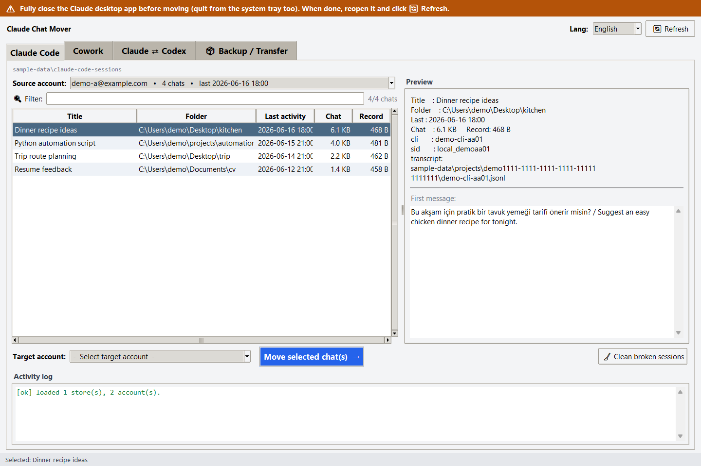
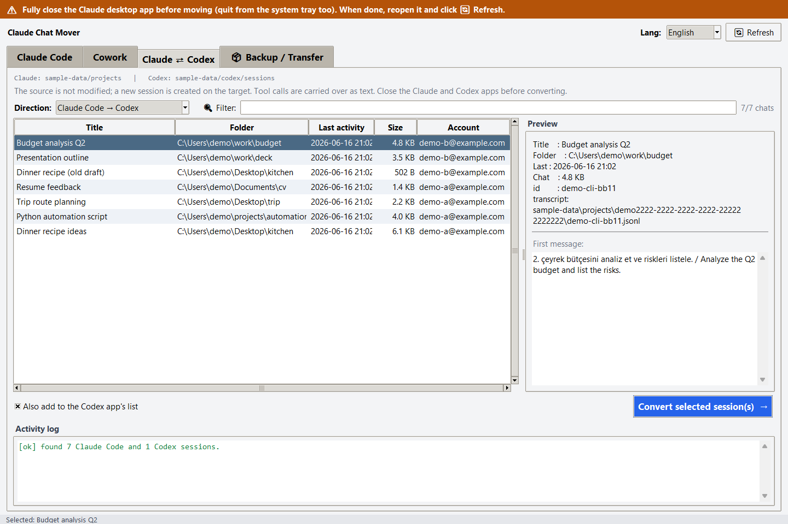
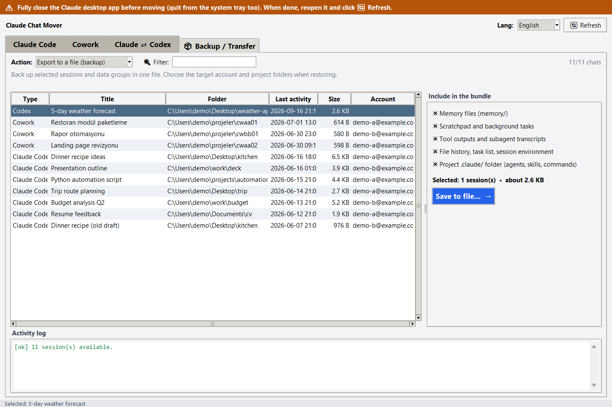
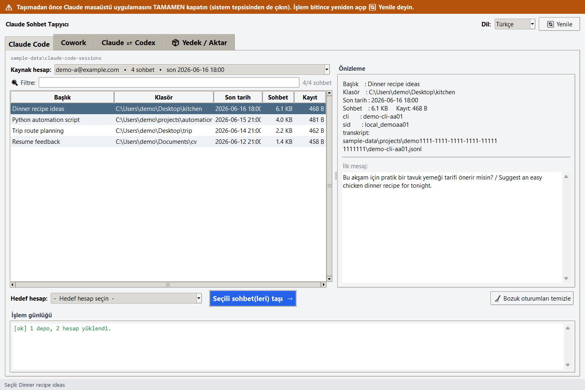
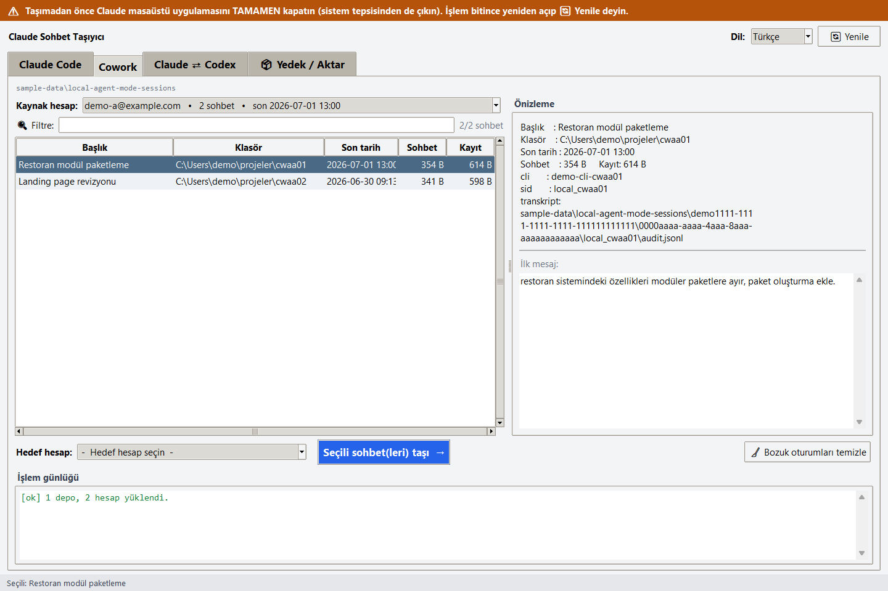
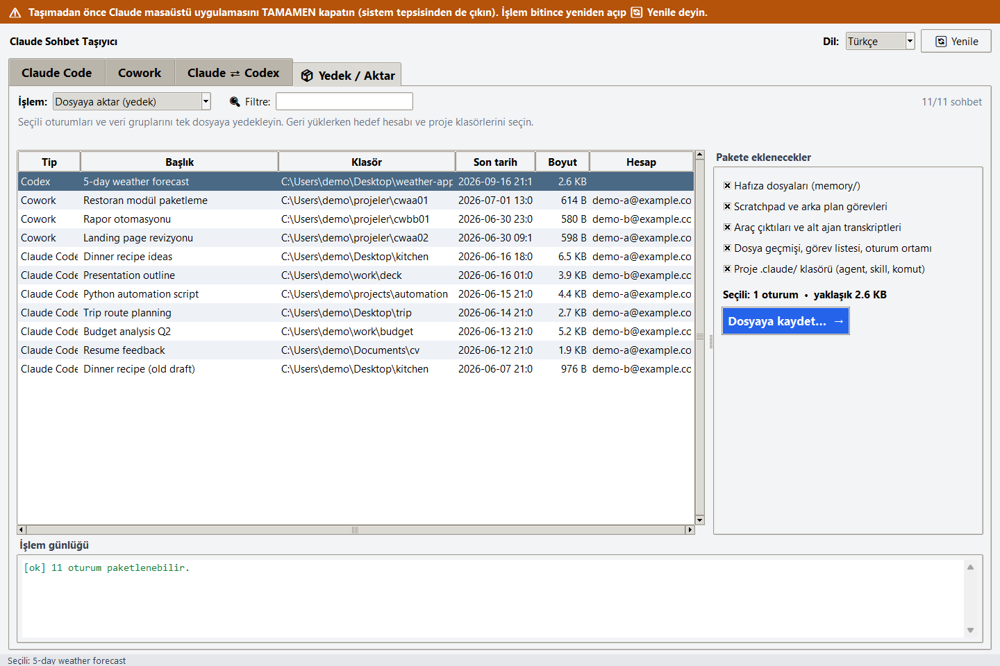
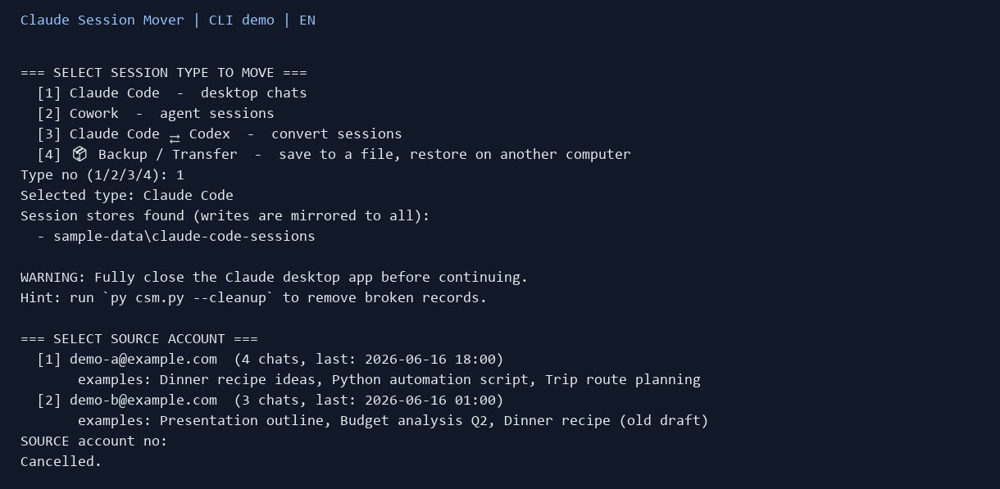
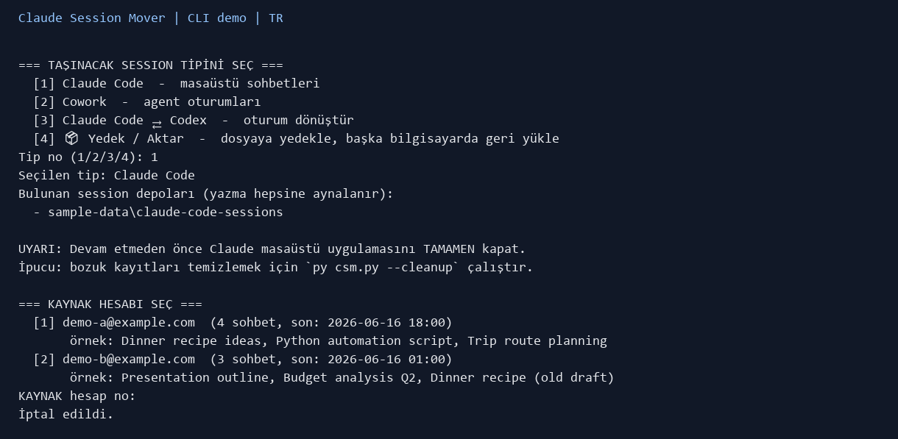

# Claude Session Mover

**Move your Claude sessions between accounts. Back them up, or continue them in Codex.**

[](https://github.com/alpersamur3/claude-session-mover/releases/latest)


[](LICENSE)

[**Download for Windows**](https://github.com/alpersamur3/claude-session-mover/releases/latest) · [English guide](#english) · [Türkçe rehber](#turkce) · [Report a bug](https://github.com/alpersamur3/claude-session-mover/issues)



| Continue in Claude or Codex | Back up sessions and project settings |
|---|---|
|  |  |

<details>
<summary>Türkçe arayüzü göster / Show the Turkish interface</summary>



| Cowork oturumları | Yedekleme seçenekleri |
|---|---|
|  |  |

</details>

All screenshots use bundled demo data. / Tüm görseller uygulamayla gelen demo verilerini kullanır.

> Community project, unaffiliated with Anthropic or OpenAI. Close relevant desktop apps, including tray processes, before writing session data. / Anthropic veya OpenAI ile bağlantısı olmayan topluluk projesidir. Oturum verilerine yazmadan önce ilgili uygulamaları sistem tepsisi dahil tamamen kapatın.

<a id="english"></a>
<details open>
<summary><strong>English - installation, features and usage</strong></summary>

## Get started

Download `ClaudeSessionMover.exe` from the [latest release](https://github.com/alpersamur3/claude-session-mover/releases/latest). No Python installation is needed for the Windows executable. `csm.exe` is the optional terminal version. The executables are unsigned; Windows may display an unknown-publisher warning. The first launch extracts the app into a temporary folder.

1. Sign in to each Claude account at least once so its local account folder exists.
2. Fully quit Claude, including other profile windows and the tray process. Also quit Codex when importing into it.
3. Open **Claude Code** or **Cowork**, choose the source account and select sessions.
4. Choose the target account explicitly. Review conflicts and size comparisons before replacing a session.
5. Reopen Claude under the target account. Use **Refresh** in the mover after account or session changes.

This tool handles **local Claude Code and Cowork sessions**. It does not transfer cloud-only Claude web conversations or switch your signed-in account.

## Four tabs

| Tab | What it does |
|---|---|
| **Claude Code** | Copies desktop session records between accounts; adapts account-bound transcripts when needed. |
| **Cowork** | Copies the record and its companion folder, adapting account/workspace references. |
| **Claude ⇄ Codex** | Creates a new session in the other agent while preserving the source. |
| **Backup / Transfer** | Exports sessions to one `.csmpack` file and restores them on another computer or account. |

Change the interface language using the top selector. Accounts display an email when available, otherwise a shortened identifier.

## How transfers work

Claude Desktop listing records live in `claude-code-sessions/<account>/<workspace>/local_*.json`; transcripts normally live under `~/.claude/projects/`. Cowork uses `local-agent-mode-sessions/` and a companion `local_<id>/` folder.

For older Code transcripts without ownership metadata, copying the record can be sufficient. When a transcript contains `ownerAccountUuid`, the mover creates a new CLI session ID, copies the transcript and session extras, adapts ownership references and updates the target record. Cloud bridge identifiers are cleared in that target copy. **The source session stays in place.**

Conflicts are identified by CLI session ID or desktop session ID. Replacing a target is a separate, explicit action; back up one you want to preserve. Writes are mirrored across detected stores, so use a custom store to restrict the destination.

## Back up and restore

In **Backup / Transfer**, select sessions and data groups, then save a `.csmpack`. To restore, open the file, review project-folder mappings and choose a target Claude account when desktop visibility is required.

| Type | Supported contents, when present |
|---|---|
| **Claude Code** | Record, transcript, subagent transcripts/tool outputs, project memory, scratchpad, edit history, session environment, task lists and project `.claude/` definitions/settings. |
| **Cowork** | Record plus companion folder: audit, outputs, uploads and its `.claude/` data. |
| **Codex** | Rollout transcript plus session-specific visualizations and generated images. |

- Terminal-only Code sessions can be exported without a desktop record. Selecting an account during restore creates the record.
- Map an old project folder to its destination before restoring. Supported text paths/account references are adapted; binary contents are preserved.
- Existing memory and project `.claude/` files are kept by default; enable overwrite to replace them.
- Project `.claude/` includes agents, skills, commands and hook settings. Dependency/cache directories such as `node_modules`, `.git`, `venv`, `build` and `cache` are excluded. User-wide `~/.claude/CLAUDE.md` and user-wide agent/skill definitions are not bundled.
- A bundle is an **unencrypted ZIP**, not an account or complete machine backup. It contains conversations and source paths; settings/environment files can contain private values. Review it before sharing.
- Use **v1.2.0+** to restore the expanded session-data and project-settings groups. Older v1.1.0 bundles remain readable.

## Continue in Claude or Codex

The bridge creates a new session with a new ID. Text messages carry over; tool calls/results become text blocks. Individual tool/reasoning blocks are capped at 50,000 characters. Images become unsupported-block markers; encrypted reasoning is not transferred, although available summaries can be retained. Conversion does not recreate every tool's execution state.

For Codex desktop visibility, enable **Add to Codex list**. The mover registers the thread in the state database and backs that database up as `state_*.sqlite.csm-bak`. Without registration, use `codex resume <id>`. For Claude desktop visibility, choose an account; without one, use `claude --resume <id>` from the project folder. Local data formats may change with desktop updates.

## Cleanup and recovery

**Clean broken sessions** / `--cleanup` removes records whose transcript cannot be found. For Cowork, it can also remove the companion folder. This operation has **no automatic backup**. Check your transcript root first: an incorrect path can make a valid session look missing. Review the list and save a backup before deleting.

Transfer preserves its source; target overwrite and cleanup have different effects. Bundle restore preserves memory/project files by default. The Codex database backup applies specifically to database registration, not every operation.

## Run from source

Python **3.8+**, with Tkinter for the GUI. Runtime modules use the standard library; PyInstaller is needed only to build EXEs. Windows is the primary target; macOS/Linux are experimental. Use `python3` there, and install your distribution's Tkinter package if necessary.

```powershell
git clone https://github.com/alpersamur3/claude-session-mover.git
cd claude-session-mover
py csmui.py --en                # GUI
py csm.py --en                  # Four-option CLI menu
py csmui.py --demo --en         # Demo accounts
py csm.py --bridge --en
py csm.py --export --en
py csm.py --import backup.csmpack --en
py csm.py --cleanup --en
```

Demo account/session roots use `sample-data/`. Copy the repository before testing writes if you want to preserve the fixtures. External bundles can refer to other project paths: review mappings even in demo mode.



## Custom paths and Claude Profiles Native

Windows AppData/Store locations and standard macOS/Linux Claude roots are detected automatically. For a custom installation:

```powershell
$env:CSM_LANG = 'en'
$env:CSM_BASE = 'D:\ClaudeData\claude-code-sessions'
$env:CSM_PROJECTS = 'D:\ClaudeData\.claude\projects'
$env:CSM_CODEX = 'D:\CodexData'   # CODEX_HOME also works
py csmui.py
```

Multiple roots use `;` on Windows, `:` on macOS/Linux. Example: `$env:CSM_BASE = 'D:\StoreA\claude-code-sessions;D:\StoreB\claude-code-sessions'`. Assignments affect the current shell and its child processes.

[Claude Profiles Native](https://github.com/alpersamur3/claude-profiles-native) stores independent profiles outside standard AppData locations; this mover does not auto-discover those roots. Set `CSM_BASE` to the profile's **actual `claude-code-sessions` directory** and `CSM_PROJECTS` to its transcript root, then launch the mover from that shell. Close relevant Claude instances before writing and reopen the target profile afterwards. If moving into the main store, profile visibility depends on the launcher's synchronization when reopening; it is not a live shared-store update.

A profile store may contain only one account. To transfer between accounts, use a main store containing both accounts, or export a bundle from the source profile and restore it into the target profile after changing the roots. Multiple `CSM_BASE` paths mirror writes; they do not combine the account lists.

If sessions do not appear, check account, store and transcript path, then **Refresh**. [Report bugs](https://github.com/alpersamur3/claude-session-mover/issues) with version, OS, operation and relevant diagnostics. Remove credentials/private conversation content from reports.

## Build and project files

```powershell
py -m pip install 'pyinstaller>=6.22'
py build.py                    # GUI + CLI
py build.py gui                # GUI only
py build.py cli                # CLI only
py -m unittest discover -s tests -v
```

Build Windows EXEs on Windows. `build.py` requires PyInstaller 6.22+ and validates executable format with Windows `GetBinaryType`; that check does not replace a launch test.

| File | Purpose |
|---|---|
| [csm.py](csm.py) | Account stores, transfer and CLI |
| [csmui.py](csmui.py) | Tkinter GUI |
| [csbridge.py](csbridge.py) | Claude Code / Codex conversion |
| [cspack.py](cspack.py) | Bundles and path mapping |
| [i18n.py](i18n.py) | English / Turkish strings |
| [build.py](build.py) | Standalone EXE build |

[Release history](CHANGELOG.md) · [MIT license](LICENSE). Screenshot regeneration on Windows: `py -m pip install Pillow`, then `py tools/generate_screenshots.py` (development-only dependency).

</details>

<a id="turkce"></a>
<details>
<summary><strong>Türkçe - kurulum, özellikler ve kullanım</strong></summary>

## Hızlı başlangıç

[Son sürümden](https://github.com/alpersamur3/claude-session-mover/releases/latest) `ClaudeSessionMover.exe` dosyasını indirip açın. Windows EXE'si için Python gerekmez; `csm.exe` terminal sürümüdür. Dosyalar imzasız olduğundan Windows yayıncı uyarısı gösterebilir. İlk açılışta uygulama geçici klasöre çıkarılır.

1. Yerel klasörlerin oluşması için her Claude hesabına en az bir kez giriş yapın.
2. Claude'u diğer profil pencereleri ve sistem tepsisi dahil tamamen kapatın. Codex'e aktarırken Codex'i de kapatın.
3. **Claude Code** veya **Cowork** sekmesinde kaynak hesabı ve sohbetleri seçin.
4. Hedefi seçin; mevcut sohbeti değiştirmeden önce çakışma ve boyut karşılaştırmasını inceleyin.
5. Claude'u hedef hesapla yeniden açın. Hesap/oturum değişikliklerinden sonra taşıyıcıda **Yenile** kullanın.

Araç **yerel Claude Code ve Cowork oturumlarını** taşır. Yalnızca buluttaki Claude web sohbetlerini taşımaz; giriş yaptığınız hesabı değiştirmez.

## Dört sekme

| Sekme | İşlev |
|---|---|
| **Claude Code** | Masaüstü kayıtlarını hesaplar arasında kopyalar; gerektiğinde hesaba bağlı transkriptleri uyarlar. |
| **Cowork** | Kayıt/yan klasörü kopyalar; hesap ve workspace referanslarını uyarlar. |
| **Claude ⇄ Codex** | Kaynağı koruyarak diğer ajanda yeni oturum oluşturur. |
| **Yedek / Aktar** | Oturumları tek `.csmpack` dosyasına çıkarır; başka bilgisayara veya hesaba yükler. |

Dili üstteki seçiciden değiştirebilirsiniz. Hesaplar bulunabildiğinde e-posta, aksi halde kısa kimlikle gösterilir.

## Taşıma nasıl çalışır?

Claude Desktop kayıtları `claude-code-sessions/<hesap>/<workspace>/local_*.json`, transkriptler genellikle `~/.claude/projects/` altında durur. Cowork, `local-agent-mode-sessions/` ve yanındaki `local_<kimlik>/` klasörünü kullanır.

Sahiplik bilgisi olmayan eski Code oturumlarında yalnızca listeleme kaydı yeterli olabilir. `ownerAccountUuid` varsa yeni CLI oturum kimliği oluşturulur; transkript/yan dosyalar kopyalanır, sahiplik referansları uyarlanır ve hedef kayıt güncellenir. Hedefteki bulut köprü kimlikleri temizlenir. **Kaynak oturum yerinde kalır.**

Çakışmalar CLI veya masaüstü oturum kimliğine göre bulunur. Hedefin üzerine yazmak ayrıca onay gerektirir; korumak istediğiniz hedefi yedekleyin. Yazma işlemleri bulunan depolara aynalanır; hedefi sınırlamak için özel depo seçin.

## Yedekleme ve geri yükleme

**Yedek / Aktar** sekmesinde oturumları/veri gruplarını seçip `.csmpack` kaydedin. Geri yüklerken dosyayı açın, proje eşlemelerini inceleyin; masaüstünde görünmesi için hedef hesabı seçin.

| Tip | Mevcutsa dahil edilebilenler |
|---|---|
| **Claude Code** | Kayıt, transkript, alt ajan konuşmaları/araç çıktıları, proje belleği, scratchpad, düzenleme geçmişi, oturum ortamı, görevler, proje `.claude/` tanımları/ayarları. |
| **Cowork** | Kayıt ve yan klasör: audit, outputs, uploads, oturuma ait `.claude/`. |
| **Codex** | Rollout transkripti, oturuma ait görselleştirmeler ve üretilmiş resimler. |

- Masaüstü kaydı olmayan terminal oturumları da paketlenir; geri yüklemede hesap seçilirse masaüstü kaydı oluşturulur.
- Eski proje klasörünü hedefe eşleyin. Desteklenen metin yolları/hesap referansları uyarlanır; ikili içerikler korunur.
- Aynı adlı bellek/proje `.claude/` dosyaları varsayılan olarak korunur; değiştirmek için üzerine yazmayı etkinleştirin.
- Proje `.claude/` grubu agent, skill, komut ve hook ayarlarını içerir. `node_modules`, `.git`, `venv`, `build`, `cache` gibi bağımlılık/önbellek klasörleri atlanır. Kullanıcı genelindeki `~/.claude/CLAUDE.md` ve kullanıcı genelindeki agent/skill tanımları dahil değildir.
- Paket **şifrelenmemiş ZIP** dosyasıdır; hesap veya tüm bilgisayar yedeği değildir. Konuşma ve kaynak yollar bulunur; ayarlar/ortam dosyaları özel değerler içerebilir. Paylaşmadan önce inceleyin.
- Genişletilmiş oturum/proje verilerini geri yüklemek için **v1.2.0+** kullanın. v1.1.0 paketleri açılabilir.

## Claude veya Codex'te devam etme

Köprü yeni kimlikle yeni oturum oluşturur. Metin mesajları aktarılır; araç çağrıları/sonuçları metin bloklarına dönüşür. Her araç/düşünce bloğu 50.000 karakterle sınırlıdır. Görseller desteklenmeyen blok işaretlerine dönüşür; şifreli düşünce aktarılmaz, mevcut özetleri korunabilir. Her aracın çalışma durumu yeniden oluşturulmaz.

Codex masaüstünde görünmesi için **Codex listesine ekle** seçin. Yerel state veritabanına kayıt eklenir; önce `state_*.sqlite.csm-bak` yedeği alınır. Aksi halde `codex resume <kimlik>` kullanın. Claude için hedef hesap seçin; seçilmezse proje klasöründe `claude --resume <kimlik>` kullanın. Yerel veri biçimleri uygulama güncellemeleriyle değişebilir.

## Temizleme ve geri alma

**Bozuk oturumları temizle** / `--cleanup`, transkripti bulunamayan kayıtları siler; Cowork'te yan klasörü de silebilir. **Otomatik yedek almaz.** Önce transkript kökünü doğrulayın: yanlış yol geçerli bir sohbeti eksik gösterebilir. Listeyi inceleyip gerekli yedeği alın.

Kopyalama kaynağı korur; hedefin üzerine yazma/temizleme farklı işlemlerdir. Paket geri yükleme bellek/proje dosyalarını varsayılan olarak korur. Codex veritabanı yedeği yalnızca veritabanına kayıt ekleme işlemine aittir.

## Kaynaktan çalıştırma

Python **3.8+**, GUI için Tkinter gerekir. Çalışma sırasında standart kütüphane kullanılır; PyInstaller yalnızca derleme içindir. Ana hedef Windows; macOS/Linux deneysel desteklenir. Bu sistemlerde `python3` kullanın, gerekiyorsa dağıtımın Tkinter paketini kurun.

```powershell
git clone https://github.com/alpersamur3/claude-session-mover.git
cd claude-session-mover
py csmui.py                     # GUI
py csm.py                       # Dört seçenekli CLI
py csmui.py --demo              # Demo hesaplar
py csm.py --bridge
py csm.py --export
py csm.py --import yedek.csmpack
py csm.py --cleanup
```

Demo hesap/oturum kökleri `sample-data/` kullanır. Veriyi korumak istiyorsanız yazma işlemlerini depo kopyasında deneyin. Dış paketler başka proje yollarına işaret edebilir; demo modunda da eşlemeleri inceleyin.



## Özel yollar ve Claude Profiles Native

Windows AppData/Store ve standart macOS/Linux depoları otomatik aranır. Özel kurulum:

```powershell
$env:CSM_LANG = 'tr'
$env:CSM_BASE = 'D:\ClaudeData\claude-code-sessions'
$env:CSM_PROJECTS = 'D:\ClaudeData\.claude\projects'
$env:CSM_CODEX = 'D:\CodexData'   # CODEX_HOME da desteklenir
py csmui.py
```

Çoklu depolar Windows'ta `;`, macOS/Linux'ta `:` ile ayrılır. Örnek: `$env:CSM_BASE = 'D:\DepoA\claude-code-sessions;D:\DepoB\claude-code-sessions'`. Atamalar mevcut terminali ve ondan başlatılan süreçleri etkiler.

[Claude Profiles Native](https://github.com/alpersamur3/claude-profiles-native) standart AppData dışındaki profilleri kullanır; taşıyıcı bunları otomatik bulmaz. `CSM_BASE` değerini profilin **gerçek `claude-code-sessions` klasörüne**, `CSM_PROJECTS` değerini transkript köküne ayarlayıp aynı terminalden başlatın. Yazmadan önce ilgili Claude örneklerini kapatıp sonra hedef profili yeniden açın. Ana depoya taşıyorsanız görünmesi başlatıcının yeniden açılışta eşitlemesine bağlıdır; anlık ortak depo güncellemesi değildir.

Bir profil deposunda yalnızca tek hesap olabilir. Hesaplar arası taşıma için iki hesabın bulunduğu ana depoyu kullanın veya kaynak profilden paket çıkarıp kökleri değiştirerek hedef profile yükleyin. Çoklu `CSM_BASE` yolları yazmayı aynalar; hesap listelerini birleştirmez.

Sohbet yoksa hesap/depo/transkript yolunu kontrol edip **Yenile** kullanın. [Hata bildirirken](https://github.com/alpersamur3/claude-session-mover/issues) sürüm, sistem, işlem ve ilgili tanı çıktısını ekleyin; giriş bilgilerini/özel konuşma içeriklerini çıkartın.

## Derleme ve proje dosyaları

```powershell
py -m pip install 'pyinstaller>=6.22'
py build.py                    # GUI + CLI
py build.py gui                # Yalnızca GUI
py build.py cli                # Yalnızca CLI
py -m unittest discover -s tests -v
```

Windows EXE'sini Windows üzerinde derleyin. `build.py`, PyInstaller 6.22+ ister ve Windows `GetBinaryType` ile dosya biçimini doğrular; bu kontrol açılış testinin yerine geçmez.

`csm.py`: taşıma/CLI · `csmui.py`: arayüz · `csbridge.py`: köprü · `cspack.py`: paketler · `i18n.py`: TR/EN · `build.py`: derleme.

[Sürüm geçmişi](CHANGELOG.md) · [MIT lisansı](LICENSE). Windows'ta görselleri yenileme: `py -m pip install Pillow`, ardından `py tools/generate_screenshots.py` (yalnızca geliştirme bağımlılığı).

</details>
